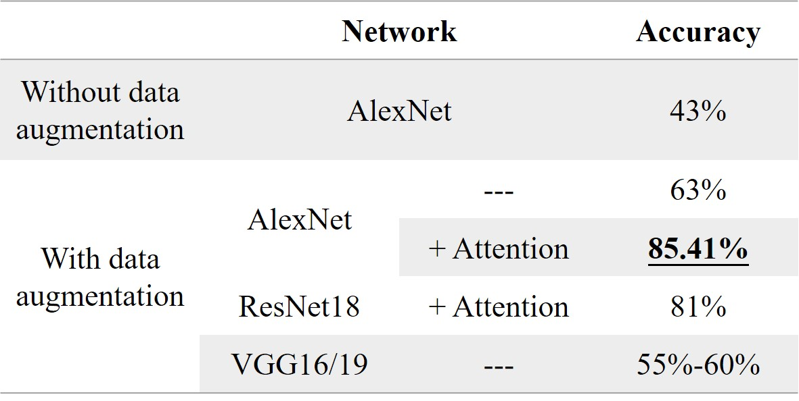

# artist_classify
我参加的MIT的机器学习课程的最后的大作业。

## Problem 

给定数据集，自行设计模型，在测试机上进行预测，准确率达到70%+即可。

## Idea

- 由于给出了标签，所以可以将这个问题看作是一个**分类问题**。可在比较有名的模型Alexnet，Resnet18进行fine tuning。（√）
- 如果我们将图像转换为一个向量，就像word2vec一样，如果存在风格相似的图像聚集在一起，就说明我们可以用聚类的方法进行分类，或者衡量向量间的“**距离**”。（×）
  - 但实际上这种相似性应该是不成立的，word vector存在这个相似性的原因可能是因为相似词语的**上下文语境**是**相似的**，但在图片中这种关系实际上是不存在的。
- 在风格迁移任务中，常用Gram矩阵来衡量style loss。如果一张照片和自己类的style loss和其它作家的图像的style loss存在显著差异，也可以用此来聚类，或者去<u>优化目标函数</u>。（×）
  - 实验中我发现并没有显著差异，甚至某一个图片和自己类的style loss比其他类的要高许多，可能需要改进衡量style loss的方式，或者只将其作为目标函数的一种优化。

## Model

### Data Augmentation

由于train dataset只有401张照片，所以我对数据集进行了增强。只采用了随机旋转的方式，但没有改变图片的颜色和对比度的信息，因为我认为这些信息可能是卷积层提取出的用于分类的信息之一。

### AlexNet

我修改了最后dense layers的规模。减少了最后全连接层的cell的数量，因为我们只有11类而非1000类。

我采用了dropout和batch normalization。

我引入了attention机制，这在resnet18中被采用，发现加入attention layer的效果有显著提升。

最好的结果的accuracy达到了85.41%。

### Resnet18

用于预置好的模型结构进行训练即可，准确率达到了81%。但较难上手修改结构。

## Result

Alexnet在colab上只需训练30epochs，一次训练少于12mins，非常快速。

## Summary

- 数据增强后，不同方式增强的数据集会对结果有影响，而且不小。
- 损失函数也许可以进一步优化，应该加上衡量画的风格的损失量。